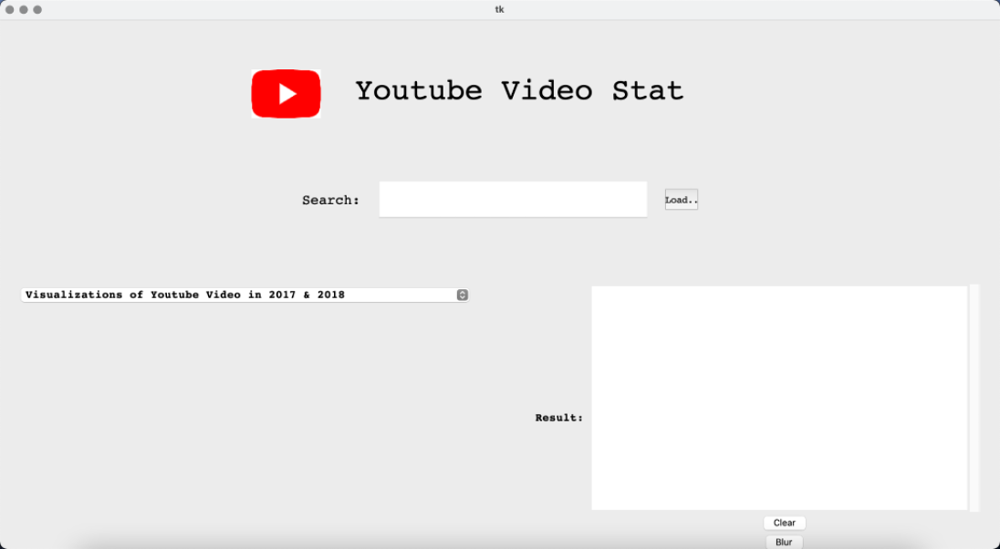
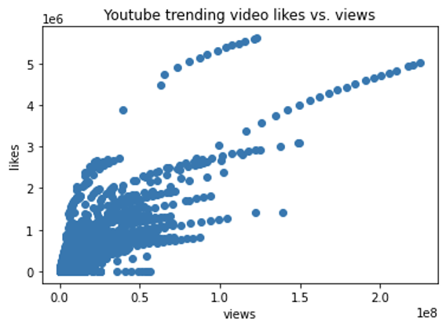

# Computational Thinking - Final Project
> This is the final project for computational thinking course, which I took when I was a junior.
 

## Table of Contents
* [General Info](#general-information)
* [Packages](#packages)
* [Screenshots](#screenshots)
* [Setup](#setup)
* [Findings](#findings)
* [Project Status](#project-status)
* [Room for Improvement](#room-for-improvement)
* [Contact](#contact)
<!-- * [License](#license) -->

## General Information
- YouTube has a trending video bar listing current trending videos on a daily basis
- I want to use data analysis to get insight into YouTube trending videos
- I created a graphical user interface (GUI) to display my analysis results.

<!-- You don't have to answer all the questions - just the ones relevant to your project. -->

## Packages
Here is Python Packages we used
- Tkinter: Create GUI
- Pandas: Create Dataframe
- Numpy: Analyze data
- Matplotlib: Plotting - visualize the data
- PIL: Image manipulation

## Screenshots
Here is what the interface looks like.

<!-- If you have screenshots you'd like to share, include them here. -->

## Setup
- The project is done by Python. It can be downloaded here: https://www.python.org/downloads/
- Before running the code, you might need to install the packages I mentioned above.
- Then you need to import those packages. To import them, please run the code in the first part of each .py file.
  - For exmaple:`import pandas as pd`

## Findings

The Entertainment category has the largest number of trending videos in both 2017 and 2018, followed by Music category, How to style, Comedy, People & blog.

Views and Likes have a positive relationship.

## Project Status
Project is: _complete_

## Room for Improvement

Code:
- Make the code shorter and more concise
- Use class to organize the code, which would be more flexible

Application Design:
- Can allow users to see the information from the data
- Have a list box to show some information about the dataset

## Contact
Created by [@yuqing-luo](https://www.linkedin.com/in/yuqing-luo-504211207/) - feel free to contact me!

<!-- Optional -->
<!-- ## License -->
<!-- This project is open source and available under the [... License](). -->

<!-- You don't have to include all sections - just the one's relevant to your project -->
